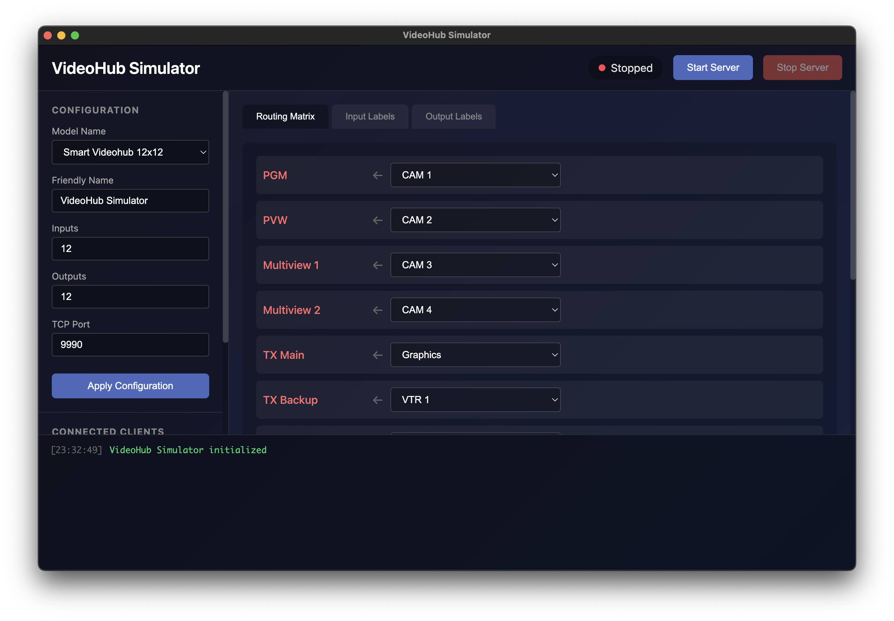

# Router Protocol Simulator

A cross-platform Electron application that simulates broadcast video routers. Supports multiple protocols including Blackmagic VideoHub and SW-P-08 (Probel/Grass Valley). Perfect for testing router control software, developing integrations, or training purposes without requiring physical hardware.



## Features

- **Multiple Protocol Support** - Switch between VideoHub and SW-P-08 protocols
- **Configurable Router Size** - Simulate routers from 12x12 up to 288x288
- **Real-time Routing Matrix** - Interactive UI to view and change routes
- **Editable Labels** - Customize input and output names
- **Pre-populated Labels** - Comes with TV station/edit suite example names
- **Multi-client Support** - Multiple control applications can connect simultaneously
- **Live Activity Log** - Monitor all protocol commands and client connections

## Supported Protocols

### Blackmagic VideoHub
- TCP port 9990 (default)
- Text-based protocol v2.8
- Full support for routing, labels, and locks
- Compatible with all VideoHub control software

### SW-P-08 (Probel/Grass Valley)
- TCP port 8910 (default)
- Binary protocol with DLE/STX framing
- Crosspoint routing and interrogation
- Source/destination label queries
- Extended commands for large routers (16-bit addressing)

## Installation

### Prerequisites

- Node.js 18 or later
- npm

### Setup

```bash
# Clone the repository
git clone https://github.com/yourusername/router-protocol-simulator.git
cd router-protocol-simulator

# Install dependencies
npm install

# Start the application
npm start
```

## Usage

1. **Select Protocol** - Choose VideoHub or SW-P-08 from the Protocol dropdown
2. **Configure Router** - Set the number of inputs/outputs and other options
3. **Start the Server** - Click "Start Server" to begin listening
4. **Connect Clients** - Point your control software to the appropriate port

### Configuration Options

| Setting | Description |
|---------|-------------|
| Protocol | VideoHub or SW-P-08 |
| Model Name | Device model reported to clients (VideoHub only) |
| Friendly Name | Custom name reported to clients |
| Inputs | Number of input ports (1-288) |
| Outputs | Number of output ports (1-288) |
| TCP Port | Server port (VideoHub: 9990, SW-P-08: 8910) |

## Protocol Details

### VideoHub Protocol

The simulator implements the Blackmagic Videohub Ethernet Protocol including:

- `PROTOCOL PREAMBLE` - Version handshake
- `VIDEOHUB DEVICE` - Device information block
- `INPUT LABELS` - Input port naming
- `OUTPUT LABELS` - Output port naming
- `VIDEO OUTPUT ROUTING` - Route assignments
- `VIDEO OUTPUT LOCKS` - Port locking (O/U/L states)
- `PING` / `ACK` - Keep-alive support

Example session:
```
PROTOCOL PREAMBLE:
Version: 2.8

VIDEOHUB DEVICE:
Device present: true
Model name: Blackmagic Smart Videohub 12x12
Video inputs: 12
Video outputs: 12

INPUT LABELS:
0 CAM 1
1 CAM 2
...
```

### SW-P-08 Protocol

The simulator implements the SW-P-08 router control protocol including:

- **Message Framing** - DLE/STX start, checksum validation
- **Crosspoint Connect** (0x02) - Route source to destination
- **Crosspoint Interrogate** (0x01) - Query current route
- **Crosspoint Tally** (0x03) - Route change notifications
- **Tally Dump** (0x21/0x22) - Bulk routing table query
- **Source Names** (0x61/0x62) - Input label query
- **Destination Names** (0x63/0x64) - Output label query
- **Extended Commands** (0x04-0x07) - 16-bit addressing for large routers

## Compatible Software

This simulator works with router control software including:

**VideoHub Protocol:**
- Bitfocus Companion
- vMix
- Blackmagic Videohub Control
- Ross DashBoard

**SW-P-08 Protocol:**
- Bitfocus Companion
- Ross Ultrix/Carbonite
- Grass Valley NV Series panels
- Lawo VSM
- Calrec consoles
- Many broadcast automation systems

## Development

```bash
# Run in development mode (with DevTools)
npm run dev
```

### Project Structure

```
router-protocol-simulator/
├── package.json
├── README.md
├── .gitignore
└── src/
    ├── main.js             # Electron main process
    ├── preload.js          # Preload script for secure IPC
    ├── index.html          # UI and renderer process
    ├── videohub-server.js  # VideoHub protocol implementation
    └── swp08-server.js     # SW-P-08 protocol implementation
```

## Troubleshooting

### "ELECTRON_RUN_AS_NODE" Error

If you see errors about Electron running as Node, the start script should handle this automatically. If issues persist, run:

```bash
unset ELECTRON_RUN_AS_NODE && npm start
```

### Port Already in Use

If the port is already in use, either:
- Stop the other application using the port
- Change the port in the simulator's configuration panel

### Connection Refused

Ensure the server is started (green status indicator) before connecting clients.

### SW-P-08 Connection Issues

- Ensure your client is configured for TCP (not serial)
- Default port is 8910
- Some clients may require specifying matrix/level 0

## License

MIT License - See [LICENSE](LICENSE) for details.

## Acknowledgments

- VideoHub protocol based on [Blackmagic Videohub Developer Information](https://documents.blackmagicdesign.com/DeveloperManuals/VideohubDeveloperInformation.pdf)
- SW-P-08 protocol based on [Grass Valley SW-P-88 Router Control Protocols](https://wwwapps.grassvalley.com/docs/Manuals/sam/Protocols%20and%20MIBs/Router%20Control%20Protocols%20SW-P-88%20Issue%204b.pdf)
