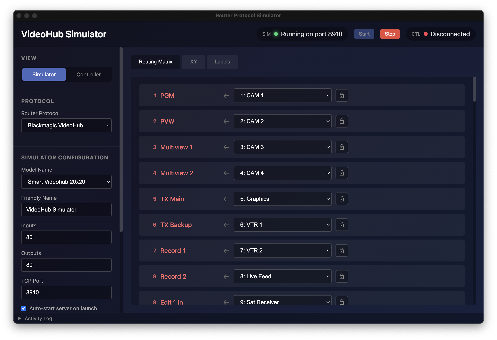
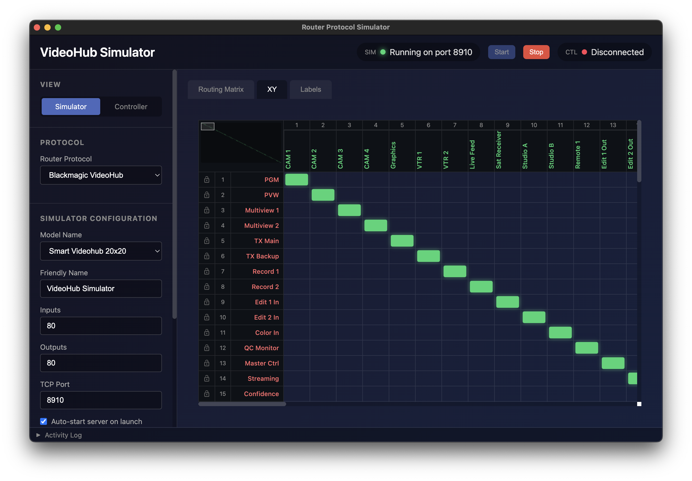
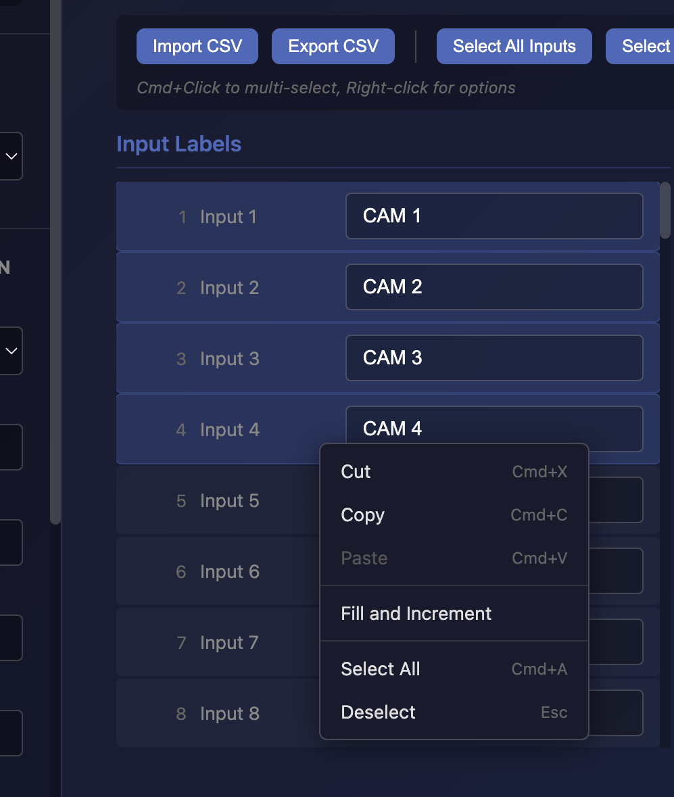
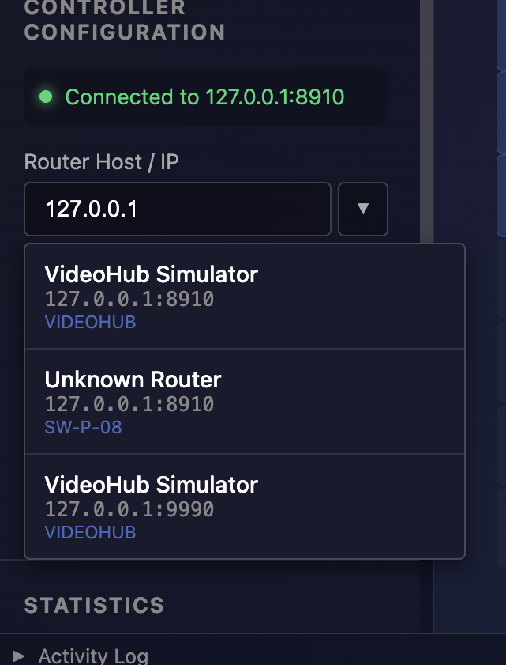

# Router Protocol Simulator

A cross-platform Electron application that simulates broadcast video routers. Supports multiple protocols including Blackmagic VideoHub and SW-P-08 (Probel/Grass Valley). Perfect for testing router control software, developing integrations, or training purposes without requiring physical hardware.

## Download

**[Download Latest Release (v2.3.1)](https://github.com/videojedi/VideoHubSim/releases/latest)**

| Platform | Download |
|----------|----------|
| macOS (Intel + Apple Silicon) | [Router Protocol Simulator-2.3.1-universal.dmg](https://github.com/videojedi/VideoHubSim/releases/download/v2.3.1/Router.Protocol.Simulator-2.3.1-universal.dmg) |
| Windows Installer | [Router Protocol Simulator Setup 2.3.1.exe](https://github.com/videojedi/VideoHubSim/releases/download/v2.3.1/Router.Protocol.Simulator.Setup.2.3.1.exe) |
| Windows Portable | [Router Protocol Simulator 2.3.1.exe](https://github.com/videojedi/VideoHubSim/releases/download/v2.3.1/Router.Protocol.Simulator.2.3.1.exe) |

## Screenshots

### List View


### Matrix View


### Labels with Context Menu


### Router Connection History


## Features

- **Multiple Protocol Support** - Switch between VideoHub, SW-P-08, and GV Native protocols
- **Configurable Router Size** - Simulate routers from 12x12 up to 288x288
- **Custom TCP Port** - Configure the server port for each protocol
- **Real-time Routing Matrix** - Interactive UI to view and change routes
- **Editable Labels** - Customize input and output names
- **Pre-populated Labels** - Comes with TV station/edit suite example names
- **Multi-level Support** - SW-P-08 matrix levels (video, audio, etc.)
- **Multi-client Support** - Multiple control applications can connect simultaneously
- **Persistent Settings** - Configuration saved across app restarts
- **Auto-start Option** - Server can start automatically on launch
- **Live Activity Log** - Monitor all protocol commands and client connections
- **XY Crosspoint Grid** - Visual crosspoint matrix view for intuitive routing
- **Saved Salvos with Stable IDs** - Rename captured salvos without changing their ID, duplicate them, and copy IDs for external integrations
- **Editable Salvo Routes** - Open an existing salvo, change routes, delete routes, or add new routes directly in the UI
- **Route Delta Logging** - Activity log can focus on routing changes and shows previous and new state for each changed destination
- **Direct Undo Actions** - Undo individual routing changes from the log or undo an entire recalled salvo as a group
- **Lock-aware Routing UI** - Locked outputs are greyed out and blocked in both List and Matrix views
- **Separate Label Reset Actions** - Reset all input labels or all output labels independently with confirmation

## Supported Protocols

### Blackmagic VideoHub
- TCP port 9990 (default, configurable)
- Text-based protocol v2.8
- Full support for routing, labels, and locks
- Compatible with all VideoHub control software

### SW-P-08 (Probel/Grass Valley)
- TCP port 8910 (default, configurable)
- Binary protocol with DLE/STX framing
- Standard and extended (16-bit) addressing
- Crosspoint routing and interrogation
- Source/destination name queries
- Multi-level matrix support

### GV Native (Series 7000)
- TCP port 12345 (default, configurable)
- Grass Valley native protocol for Series 7000 routers
- Multi-level matrix support

## Installation

### Pre-built Binaries (Recommended)

Download the appropriate installer for your platform from the [releases page](https://github.com/videojedi/VideoHubSim/releases/latest).

### Building from Source

#### Prerequisites

- Node.js 16 or later
- npm

#### Setup

```bash
# Clone the repository
git clone https://github.com/videojedi/VideoHubSim.git
cd VideoHubSim

# Install dependencies
npm install

# Start the application
npm start

# Build for your platform
npm run build:mac   # macOS
npm run build:win   # Windows
```

## Usage

1. **Select Protocol** - Choose VideoHub or SW-P-08 from the Protocol dropdown
2. **Configure Router** - Set the number of inputs/outputs, TCP port, and other options
3. **Start the Server** - Click "Start Server" to begin listening
4. **Connect Clients** - Point your control software to the appropriate port

### Saved Salvos

- Captured salvos keep a stable internal ID even if you rename them later.
- Each saved salvo shows its ID in the UI. Clicking the ID copies it to the clipboard.
- Salvos can be duplicated as a new salvo with a fresh ID.
- Existing salvos can be expanded to edit their stored routes directly.

### Activity Log and Undo

- The Activity Log can be filtered with Show only changed routings.
- Routing entries show the destination, the new source, and the previous source.
- Each routing entry offers a direct undo action.
- Recalling a salvo creates a grouped undo action for the routes that were actually applied.

### Output Locks

- In VideoHub mode, locked outputs cannot be changed in either the List view or the Matrix view.
- Locked rows are dimmed so you can see immediately which destinations are protected.

app### External Control API

The app now exposes a localhost control API intended for custom automation and Companion integration. The API sits above the internal simulator/controller abstraction, so the same calls can target the active simulator view or a connected controller.

- Default bind: `127.0.0.1:9123`
- Default state: enabled on localhost
- Optional auth: set `VIDEOHUBSIM_EXTERNAL_CONTROL_TOKEN` and send it as `Authorization: Bearer ...` or `X-Auth-Token`
- Optional overrides: `VIDEOHUBSIM_EXTERNAL_CONTROL_ENABLED`, `VIDEOHUBSIM_EXTERNAL_CONTROL_HOST`, `VIDEOHUBSIM_EXTERNAL_CONTROL_PORT`, `VIDEOHUBSIM_EXTERNAL_CONTROL_TOKEN`

Available endpoints:

- `GET /api/health` - API status and current app mode
- `GET /api/state?target=active|simulator|controller` - current routing state, numeric crosspoints, labels for separate choice lists, and matching salvos
- `GET /api/choices?target=active|simulator|controller` - Companion-friendly dropdown data for inputs, outputs, levels, and salvos
- `GET /api/salvos` - saved salvos with stable IDs
- `POST /api/route` - set a route using human 1-based numbers by default, for example `{ "output": 1, "input": 15 }`
- `POST /api/salvos/:id/recall` - recall a saved salvo by ID
- `GET /api/events` - Server-Sent Events stream with initial `health`, `state`, `choices`, and `salvos` payloads plus live app events

Examples:

```bash
curl http://127.0.0.1:9123/api/health
curl http://127.0.0.1:9123/api/state
curl -X POST http://127.0.0.1:9123/api/route \
    -H 'Content-Type: application/json' \
    -d '{"output":1,"input":15}'
curl -X POST http://127.0.0.1:9123/api/salvos/salvo_123/recall \
    -H 'Content-Type: application/json' \
    -d '{}'
```

### Configuration Options

| Setting | Description |
|---------|-------------|
| Protocol | VideoHub, SW-P-08, or GV Native |
| Model Name | Device model reported to clients (VideoHub only) |
| Friendly Name | Custom name reported to clients |
| Inputs | Number of input ports (1-288) |
| Outputs | Number of output ports (1-288) |
| TCP Port | Server port (default: VideoHub 9990, SW-P-08 8910, GV Native 12345) |
| Matrix Levels | Number of levels for SW-P-08/GV Native (video, audio, etc.) |
| Auto-start | Automatically start server when app launches |

## Protocol Details

### VideoHub Protocol

The simulator implements the Blackmagic Videohub Ethernet Protocol including:

- `PROTOCOL PREAMBLE` - Version handshake
- `VIDEOHUB DEVICE` - Device information block
- `INPUT LABELS` - Input port naming
- `OUTPUT LABELS` - Output port naming
- `VIDEO OUTPUT ROUTING` - Route assignments
- `VIDEO OUTPUT LOCKS` - Port locking (O/U/L states)
- `PING` / `ACK` - Keep-alive support

Example session:
```
PROTOCOL PREAMBLE:
Version: 2.8

VIDEOHUB DEVICE:
Device present: true
Model name: Blackmagic Smart Videohub 12x12
Video inputs: 12
Video outputs: 12

INPUT LABELS:
0 CAM 1
1 CAM 2
...
```

### SW-P-08 Protocol

The simulator implements the SW-P-08 router control protocol including:

- **Message Framing** - DLE/STX start, BTC, checksum validation
- **Crosspoint Connect** (0x02) - Route source to destination
- **Crosspoint Interrogate** (0x01) - Query current route
- **Crosspoint Tally** (0x03) - Route change notifications
- **Crosspoint Connected** (0x04) - Route confirmation
- **Tally Dump Request** (0x15) - Bulk routing table query
- **Source Names** (0x64/0x6a) - Input label request/response
- **Destination Names** (0x66/0x6b) - Output label request/response
- **Extended Commands** (0x81-0x84, 0xe4-0xeb) - 16-bit addressing for large routers

## Compatible Software

This simulator works with router control software including:

**VideoHub Protocol:**
- Bitfocus Companion
- vMix
- Blackmagic Videohub Control
- Ross DashBoard

**SW-P-08 Protocol:**
- Bitfocus Companion
- Ross Ultrix/Carbonite
- Grass Valley NV Series panels
- Lawo VSM
- Calrec consoles
- Many broadcast automation systems

## Development

```bash
# Run in development mode (with DevTools)
npm run dev
```

### Project Structure

```
VideoHubSim/
├── package.json
├── README.md
├── LICENSE
├── .gitignore
├── build/
│   ├── icon.icns          # macOS icon
│   ├── icon.png           # Windows/Linux icon
│   └── icon.svg           # Source icon
└── src/
    ├── main.js             # Electron main process
    ├── preload.js          # Preload script for secure IPC
    ├── index.html          # UI and renderer process
    ├── videohub-server.js  # VideoHub protocol implementation
    ├── swp08-server.js     # SW-P-08 protocol implementation
    └── gvnative-server.js  # GV Native protocol implementation
```

## Troubleshooting

### "ELECTRON_RUN_AS_NODE" Error

If you see errors about Electron running as Node, the start script should handle this automatically. If issues persist, run:

```bash
unset ELECTRON_RUN_AS_NODE && npm start
```

### Port Already in Use

If the port is already in use, either:
- Stop the other application using the port
- Change the port in the simulator's configuration panel

### Connection Refused

Ensure the server is started (green status indicator) before connecting clients.

### SW-P-08 Connection Issues

- Ensure your client is configured for TCP (not serial)
- Default port is 8910
- Some clients may require specifying matrix/level 0

## Changelog

### v2.3.1
- Fix auto-connect on launch not working when simulator is also auto-starting
- Fix auto-connect and auto-reconnect settings not being saved

### v2.3.0
- Salvos: Capture and recall crosspoint configurations
- Select specific destinations or capture all routes at once
- Multi-level support: choose which level to capture for SW-P-08/GV Native
- Quick-access salvo recall buttons on XY grid panel
- Salvos persist across sessions
- Import/Export salvos as CSV with duplicate resolution (overwrite, rename, skip)
- Router history entries now show a visible delete button

### v2.2.2
- Fill and Increment now supports letter sequences (e.g., "VTR A" → "VTR B" → "VTR C")
- Tab key cycles vertically through label fields with wrap-around

### v2.2.1
- Auto-update notification: checks GitHub releases on startup and shows banner when new version available

### v2.2.0
- XY Grid: Minimap overview in top-left corner showing entire matrix with viewport indicator
- XY Grid: Click/drag minimap to navigate large routers quickly
- XY Grid: Separate row/column for input and output index numbers
- XY Grid: Auto-scroll when dragging crosspoints near viewport edges
- Controller: Router connection history dropdown with recent routers
- Controller: Saves router name, address, port, and protocol for quick reconnection

### v2.1.1
- Added About panel with Video Walrus Ltd branding and copyright
- Application menu with About option on macOS and Windows

### v2.1.0
- Enhanced Labels panel with combined input/output view
- Multi-selection support (Shift+Click for range, Ctrl/Cmd+Click to toggle)
- Right-click context menu with Cut, Copy, Paste operations
- Fill and Increment: auto-generate sequential labels (e.g., "CAM 1" → "CAM 2", "CAM 3")
- CSV import/export with 4-column format (Input Index, Input Label, Output Index, Output Label)
- Tab key navigation through label fields
- Controller mode: label editing disabled until connected to router
- Keyboard shortcuts: Ctrl+A (select all), Ctrl+C/X/V (copy/cut/paste), Escape (deselect)

### v2.0.3
- Simplified architecture: Simulator and controller now fully independent
- View toggle switches between simulator and controller display
- Start simulator and connect controller in any combination
- Controller defaults to localhost (127.0.0.1) for easy local testing
- Collapsible activity log panel with disclosure triangle
- XY grid now fills the available panel space
- Header shows both SIM and CTL status indicators
- Removed "Dual Test" mode (no longer needed)

### v2.0.2
- Added destination lock support for BlackMagic VideoHub protocol
- Lock/unlock buttons in routing grid and XY crosspoint view
- Visual lock status indicators (red=locked by you, orange=locked by other)
- NAK response handling reverts crosspoint to previous state
- Lock status changes shown in activity log

### v2.0.1
- Added Dual Test mode for local controller testing

### v2.0.0
- Major refactoring: Protocol logic separated into dedicated controller modules
- UI improvements and layout enhancements
- Cleaner code architecture for better maintainability

### v1.3.1
- XY grid: Hover highlights row and column headers
- XY grid: Click-and-drag for sequential 1:1 routing (diagonal or vertical)

### v1.3.0
- Added GV Native (Series 7000) protocol support
- Added XY crosspoint grid view for visual matrix routing
- Model selection now auto-populates input/output counts

### v1.2.1
- Decode SW-P-08 command names in activity log

### v1.2.0
- Add destination and input numbers to routing matrix display

### v1.1.1
- Fixed TCP port configuration not being applied

### v1.1.0
- Added funky router-style app icon
- Fixed port field not being editable

### v1.0.0
- Initial release
- VideoHub protocol support
- SW-P-08 protocol support with multi-level matrix
- Persistent settings
- Auto-start option

## License

MIT License - See [LICENSE](LICENSE) for details.

## Acknowledgments

- VideoHub protocol based on [Blackmagic Videohub Developer Information](https://documents.blackmagicdesign.com/DeveloperManuals/VideohubDeveloperInformation.pdf)
- SW-P-08 protocol based on [Grass Valley SW-P-88 Router Control Protocols](https://wwwapps.grassvalley.com/docs/Manuals/sam/Protocols%20and%20MIBs/Router%20Control%20Protocols%20SW-P-88%20Issue%204b.pdf)
- SW-P-08 implementation informed by [Bitfocus Companion Generic SWP08 Module](https://github.com/bitfocus/companion-module-generic-swp08)
